# REST-GraphQL-Thesis

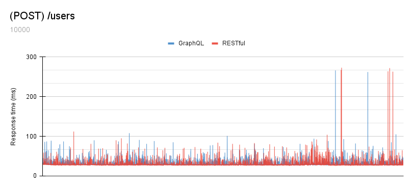 
5000 iterations. GraphQL had an average response time of 31.2ms and RESTful had an average response time of 29.8ms.

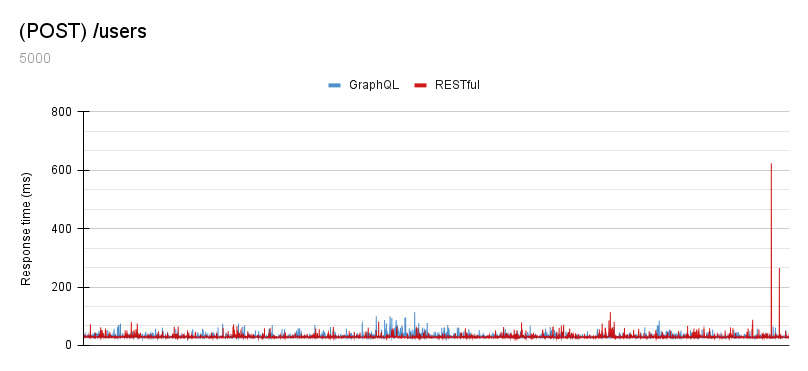 
10000 iterations. GraphQL had an average response time of 30.3ms and RESTful had an average response time of 29.7ms.

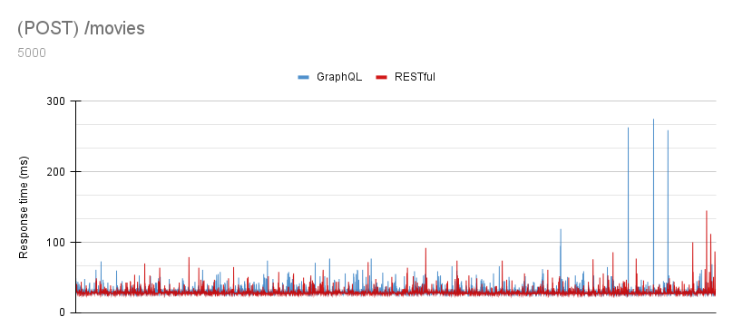 
5000 iterations. GraphQL had an average response time of 30.1ms and RESTful had an average response time of 29ms.

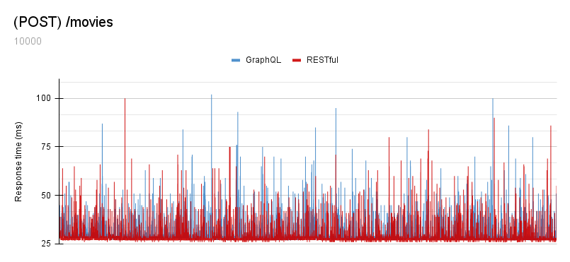 
10000 iterations. GrapgQL had an average response time of 29.7ms and RESTful had an average response time of 28.8ms. 

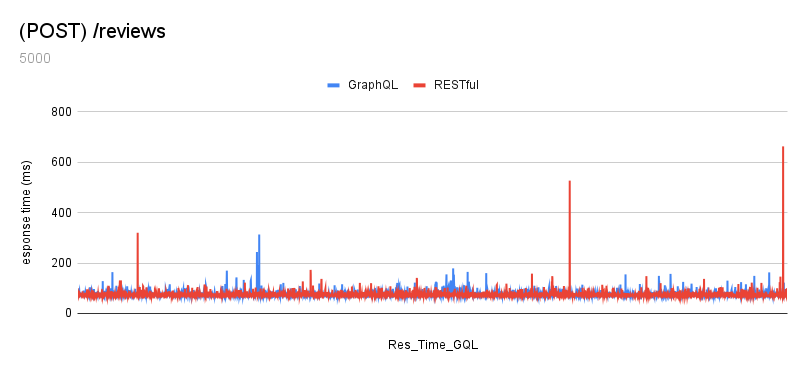 
5000 iterations. GraphQL had an average response time of 75.7ms and RESTful had an average response time of 74.4ms.

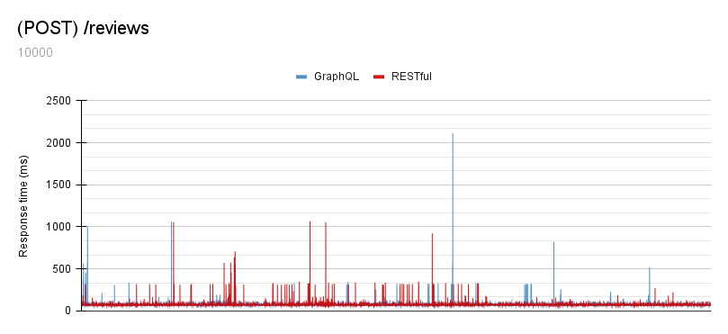 
10000 iterations. GraphQL had an average response time of 77.2ms and RESTful had an average response time of 76.8ms.

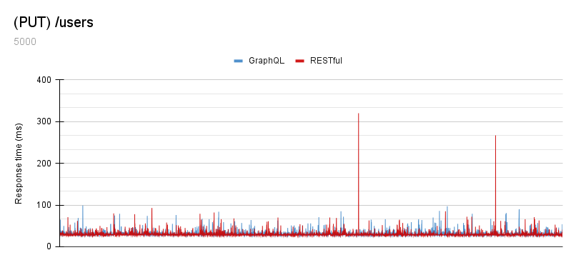 
5000 iterations. GraphQL had an average response time of 31ms, the fastest measured response time of 28ms and the slowest response time of 99ms. RESTful had an average response time of 30.1ms, the fastest measured response time of 27ms and the slowest response time of 320ms.

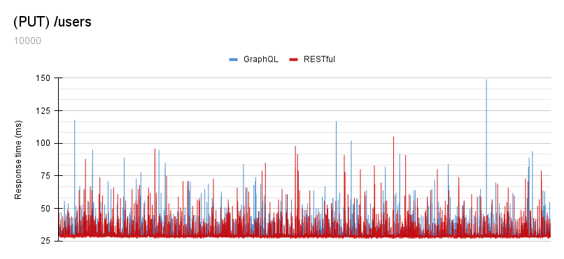 
10000 iterations. GraphQL had an average response time of 30.8ms, the fastest measured response time of 27ms and the slowest response time of 149ms. RESTful had an average response time of 31.1ms, the fastest measured response time of 27ms and the slowest response time of 105ms.

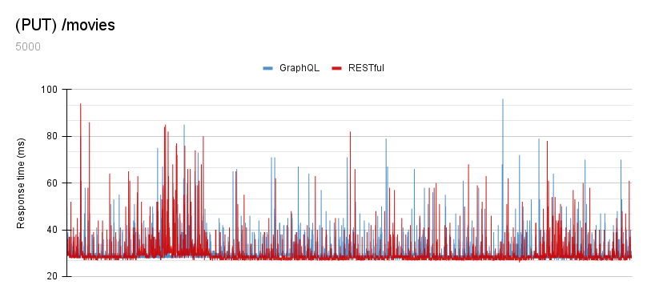 
5000 iterations. GraphQL had an average response time of 29.8ms, the fastest measured response time of 27ms and the slowest response time of 96ms. RESTful had an average response time of 29.6ms, the fastest measured response time of 27ms and the slowest response time of 94ms.

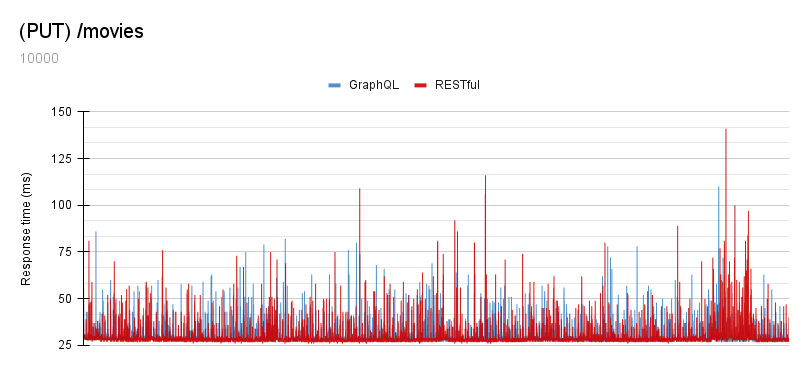 
10000 iterations. GraphQL had an average response time of 29.5ms, the fastest measured response time of 27ms and the slowest response time of 110ms. RESTful had an average response time of 29.4ms, the fastest measured response time of 27ms and the slowest response time of 141ms.

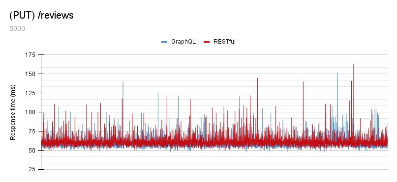 
5000 iterations. GraphQL had an average response time of 59.6ms, the fastest measured response time of 48ms and the slowest response time of 152ms. RESTful had an average response time of 61.3ms, the fastest measured response time of 49ms and the slowest response time of 163ms.

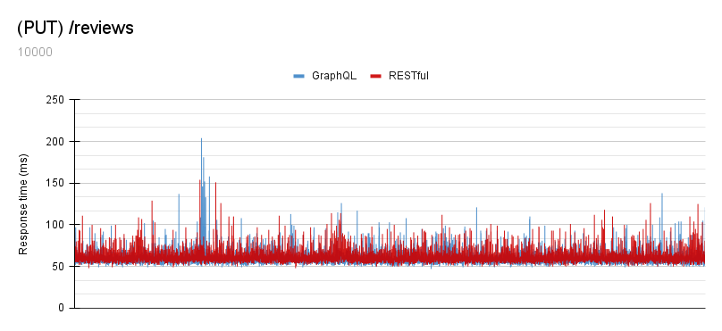 
10000 iterations. GraphQL had an average response time of 59.2ms, the fastest measured response time of 47ms and the slowest response time of 204ms. RESTful had an average response time of 61.3ms, the fastest measured response time of 48ms and the slowest response time of 154ms.

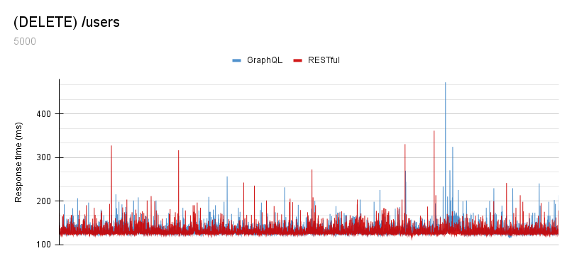 
5000 iterations. GraphQL had an average response time of 133ms, the fastest measured response time of 117ms and the slowest response time of 473ms. RESTful had an average response time of 132ms, the fastest measured response time of 116ms and the slowest response time of 362ms.

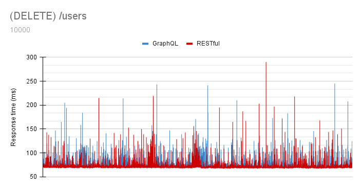 
10000 iterations. GraphQL had an average response time of 73.8ms, the fastest measured response time of 68ms and the slowest response time of 245ms. RESTful had an average response time of 72.1ms, the fastest measured response time of 67ms and the slowest response time of 290ms.

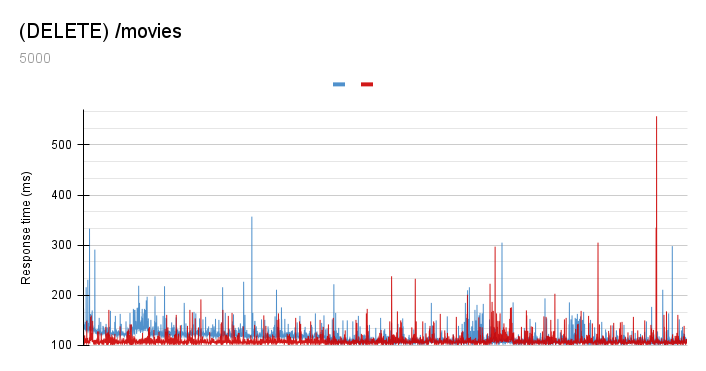 
5000 iterations. GraphQL had an average response time of 116.4ms, the fastest measured response time of 104ms and the slowest response time of 357ms. RESTful had an average response time of 109.3ms, the fastest measured response time of 103ms and the slowest response time of 557ms.

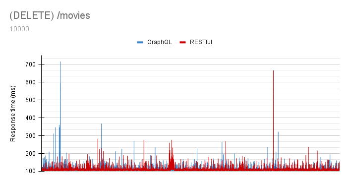 
10000 iterations. GraphQL had an average response time of 110.2ms, the fastest measured response time of 103ms and the slowest response time of 716ms. RESTful had an average response time of 108.9ms, the fastest measured response time of 102ms and the slowest response time of 666ms.

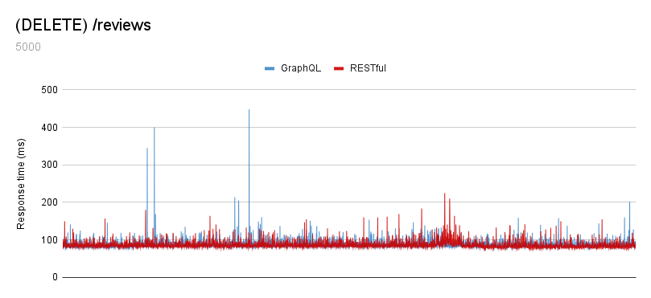 
5000 iterations. GraphQL had an average response time of 87.9ms, the fastest measured response time of 77ms and the slowest response time of 448ms. RESTful had an average response time of 86.8ms, the fastest measured response time of 76ms and the slowest response time of 225ms.

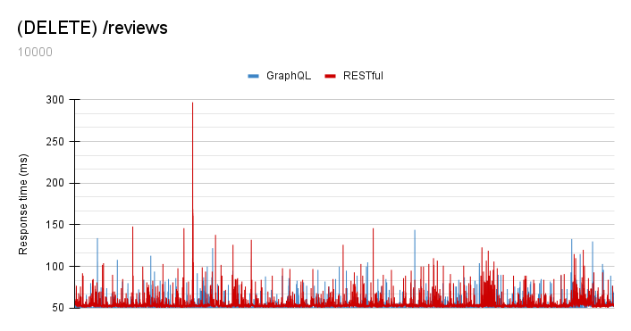 
10000 iterations. GraphQL had an average response time of 51.2ms, the fastest measured response time of 47ms and the slowest response time of 144ms.RESTful had an average response time of 54.5ms, the fastest measured response time of 49ms and the slowest response time of 297ms.
